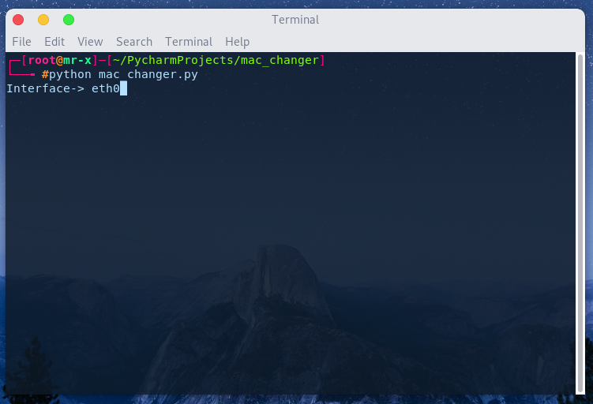

# Simple-Mac-Changer
This MAC Changer script written in Python. It will change your mac temporarily for specified Interface.

# How To Use:

Open Up your Terminal and type python mac_changer.py .
  
Write Your Interface name and Hit enter.
  
Then again type your new MAC (xx:xx:xx:xx:xx:xx) and hit enter.
  
  
To verify type: ifconfig in Terminal.  
  
That's it.
